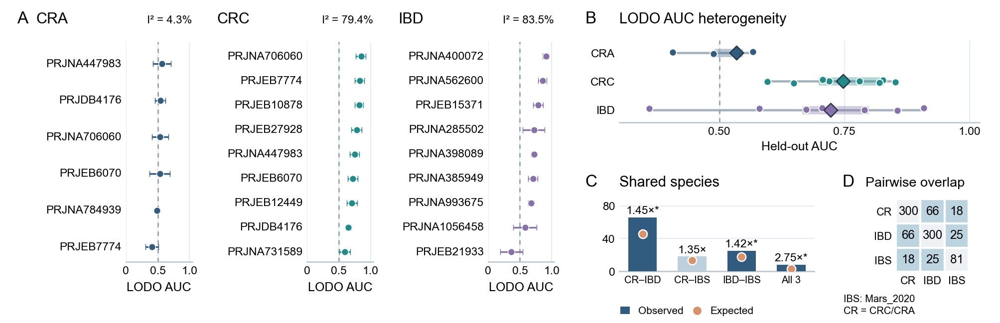

# Figure 1A–D: reproducible analysis and public data

This repository contains the figure-level inputs, code and documentation for Figure 1A–D, species-level IBS selection evidence, and a ZIP archive of sample-level species abundance profiles and disease-comparison labels from 20 cohorts.



[Final PDF](figures/Figure1_ABCD.pdf) · [Editable SVG](figures/Figure1_ABCD.svg) · [Source Data Excel](source_data/Source_Data_Figure1.xlsx)

## Repository layout

```text
input/          Figure-level input tables and IBS species selection evidence
scripts/        Reproduction, document export and validation code
source_data/    Reference numerical results: Excel and five TSV tables
analysis/       Null-overlap counts and supporting heterogeneity calculations
figures/        Final PDF, PNG preview and editable SVG
docs/          Methods, legend, data dictionary and data availability
requirements.txt
MANIFEST.tsv
Figure1_cohort_species_public.zip
.gitignore
```

- `input/panel_a_lodo_auc.tsv`: 24 disease-by-project AUC estimates with confidence intervals and aggregate sample counts.
- `input/species_sets.tsv`: selected CRC/CRA, IBD and Mars_2020 IBS species-set memberships (300, 300 and 81 species). The IBS set comprises candidates retained by five-fold random-forest Top-50 screening; individual-species FDR significance was not required.
- `input/species_detection_backgrounds.tsv`: the corresponding detectable-species backgrounds (1813, 1357 and 465 species).
- `input/ibs_species_selection.tsv`: species-level abundance, differential-test and random-forest selection evidence for all 465 eligible-background species in Mars_2020, including membership in the 81-species Figure 1 set.
- `Figure1_cohort_species_public.zip`: pseudonymized, analysis-eligible MetaPhlAn 4 species abundance profiles and minimal case/control grouping files for 20 cohorts: 10 colorectal, 9 IBD and one IBS cohort. It contains 6,264 profiled samples and 934,240 abundance rows. Repeated visits or longitudinal specimens can occur, so samples must not be counted as independent participants. Shared controls can also be reused across disease comparisons.
- `scripts/reproduce.py`: validates inputs, calculates the statistics, exports source tables and draws the figure.
- `scripts/export_docs.py`: generates the legend, results text and Word document from the numerical outputs.
- `scripts/validate_release.py`: checks file integrity, data consistency, figure formatting and optional reproduction results.

The PDF, SVG, PNG and source-data workbook are distributed here. Reproduction additionally generates TIFF and Word documents in `reproduced/`.

## Setup and reproduction

Verified with Python 3.10.12 and the exact direct dependency versions in `requirements.txt`.

```bash
python3 -m venv .venv
source .venv/bin/activate
python -m pip install -r requirements.txt
python scripts/reproduce.py
python scripts/validate_release.py --reproduced reproduced
```

**Arial Regular must be installed separately.** The font file is not included. The script checks for Arial rather than silently substituting another font.

Reproduction reads only the released local inputs and writes into `reproduced/`; reference figures and tables remain intact. No credentials or data downloads are required for the calculation. Dependency installation may require network access. Paths are resolved from the script location, so execution from a different working directory is supported. Use `--output-dir` to choose another destination.

Generated outputs include PDF/SVG/PNG/TIFF figures, Excel/TSV source data, saved simulation counts, exploratory heterogeneity results, Markdown descriptions and a Word document. Metadata can vary across regenerated PDF/SVG/Office files; numerical results and image content are compared instead of requiring identical file bytes.

Validate the repository without rerunning the simulation:

```bash
python scripts/validate_release.py
```

## Figure and methods

The final canvas is **170 × 55 mm**, with black Arial Regular text and no alternating row shading. Panel A annotates exploratory logit-AUC I²; panel C bar labels are observed/expected fold enrichment.

Overlap calculations use **100,000** independent fixed-size draws from each group's own background, seed **20260903**, plus-one upper-tail p values and BH adjustment over four comparisons. An asterisk requires q < 0.05 and observed overlap above the null 95th percentile. This q value applies to species-set overlap, not to the differential abundance of individual species. Selected-set membership does not by itself establish individual-species significance.

The I² calculation uses approximate standard errors obtained from transformed bootstrap confidence-interval widths and does not model correlation caused by overlapping LODO training sets. It is exploratory, not confirmatory inference.

- [Figure legend](docs/Figure1_legend.md)
- [Methods](docs/Figure1_methods.md)
- [Data dictionary](docs/Data_dictionary.md)
- [Data availability and scope](docs/Data_availability.md)
- [Supporting analysis records](analysis/README.md)
- [Verification report](docs/Repository_verification.md)

## Scope

This repository reproduces the **figure-level calculations and final figure** from aggregate AUCs and selected-species tables. The companion ZIP provides sample-level species abundances and comparison labels; it contains processed profiles, not raw sequencing reads. Individual predictions and the model-training and initial species-screening code are not included. The IBS evidence table documents the selection of its 81 candidates but does not rerun random-forest screening. Public project accessions, study codes and source URLs are retained where available; data scope and limitations are documented in Data Availability. The companion archive has its own README and validation script; extract it outside this repository to keep the distributed file manifest intact.

Upload the contents of this folder as the repository root. Generated files (`reproduced/`), local virtual environments and Python caches are excluded by `.gitignore`. `MANIFEST.tsv` records the exact distributed files and their SHA-256 checksums.
